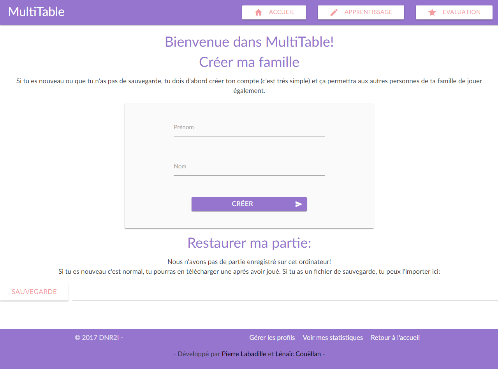
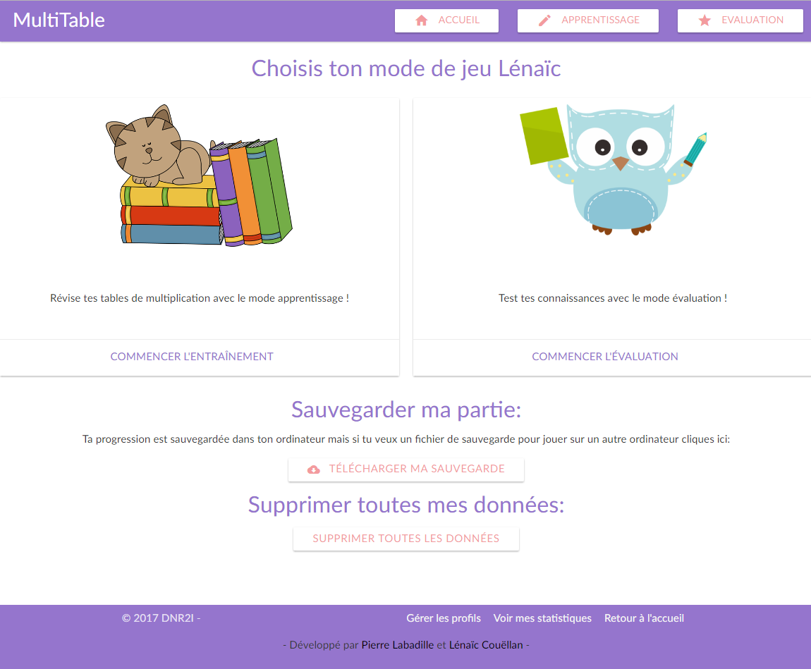

# timesTable
Project in UMDN4A: Génie logiciel et Web services proposed by Stéphane Bouvry, the purpose of the application is to provide a serious game for kids to train multiplication tables.

The application is divided in two different mods : "Training" and "Evaluation".
You need first to create a new profile, then you can try the "training" mode. 
When you train all ten tables, "evaluation" mode is unlocked. 
You can visualize the statistics for each tables and evaluations in a separate page.

It's a group project involving Lénaïc Couellan and Pierre Labadille, students in M2-DNR2i from the University of Caen.



## Installing

Clone the repository (localy or in web server)
```
git clone https://github.com/lcouellan/timesTable.git
cd timesTable
```
start "index.html" in a new brower page.

## Starting game

First, you need to create a family. You can create many profiles if you have several children playing on the same brower.
Then you can go to "Training mode" and train every multiplication tables from one to ten.
Aften trying every table, "Evaluation mode" if unlocked and provide ten operation mixed in the ten multiplication tables.
When you are done, you can check your statistics in the "Statistics" page.



## Built with

* [`Vue.js`](https://vuejs.org/)
* [`Vue-router`](https://router.vuejs.org/en/)
* [`Materialize`](http://materializecss.com/)


## License

This project is licensed under the GNU License - see the [LICENCE](LICENSE) file for details
